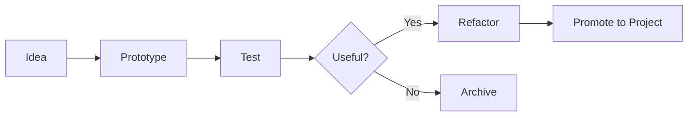

<div align="center">


<br />

<p>
  <strong>Prototype safely.</strong> <strong>Validate quickly.</strong> <strong>Promote only what works.</strong>
</p>

<p>
  <code>Sandbox</code> · <code>Experiments</code> · <code>Validation</code> · <code>CI/CD Testing</code> · <code>Prototypes</code>
</p>

</div>

---

<div align="center">

<table>
<tr>
<td align="center" width="25%"><strong>Type</strong><br />Sandbox</td>
<td align="center" width="25%"><strong>Status</strong><br />Experimental</td>
<td align="center" width="25%"><strong>Use</strong><br />Validation</td>
<td align="center" width="25%"><strong>Scope</strong><br />Disposable Prototypes</td>
</tr>
</table>

</div>

---

## 01 · Overview

<table>
<tr>
<td width="58%" valign="top">

### Controlled experimentation for engineering ideas

This repository is a lightweight sandbox for validating small ideas, testing workflows, and experimenting with project structures before they are promoted into production-grade repositories.

It is intentionally minimal, but structured to keep experiments readable, reversible, and easy to inspect.

</td>
<td width="42%" valign="top">

```text
┌──────────────────────────────┐
│  ENGINEERING SANDBOX         │
├──────────────────────────────┤
│  Input      Idea / Test Case │
│  Process    Build + Validate │
│  Output     Keep / Refactor  │
│  Promote    Stable Concepts  │
│  Scope      Non-production   │
└──────────────────────────────┘
```

</td>
</tr>
</table>

---

## 02 · Workflow


---

## 03 · Operating Model



---

## 04 · Key Uses

| Use Case | Purpose |
|---|---|
| Feature experiments | Validate small ideas before adding them to larger repositories. |
| Workflow testing | Try GitHub, CI/CD, documentation, or automation workflows safely. |
| Dependency checks | Test package behavior before introducing dependencies elsewhere. |
| UI / code prototypes | Explore lightweight concepts without affecting stable projects. |
| Repository templates | Test README, folder, and asset patterns before reuse. |

---

## 05 · Recommended Structure

```text
.
├── assets/
│   └── brand/
│       ├── hero.svg
│       └── workflow.svg
├── experiments/
│   └── example-experiment/
│       ├── README.md
│       └── main.*
├── docs/
│   └── notes.md
└── README.md
```

---

## 06 · Usage

Clone the repository:

```bash
git clone https://github.com/ns7523/test.git
cd test
```

Create a new isolated experiment:

```bash
mkdir -p experiments/my-experiment
cd experiments/my-experiment
```

Recommended experiment contract:

```text
README.md   What is being tested and why
main.*      Minimal runnable prototype
notes.md    Findings, tradeoffs, and next action
```

---

## 07 · Screenshots & Assets

<table>
<tr>
<td width="50%" valign="top">

### Experiment Index

`assets/screenshots/experiment-index.png`

A clean overview of active and archived experiments.

</td>
<td width="50%" valign="top">

### Workflow Result

`assets/screenshots/workflow-result.png`

Example output from a tested workflow or prototype.

</td>
</tr>
</table>

---

## 08 · Future Improvements

- [ ] Add `experiments/` folder with one README per experiment.
- [ ] Add a simple experiment index table.
- [ ] Add templates for quick test cases.
- [ ] Add GitHub Actions workflow experiments if needed.
- [ ] Archive outdated experiments clearly.
- [ ] Add a formal license if the repository becomes reusable.

---

<div align="center">

### N S Akash

**AI & Cybersecurity Engineer**

[GitHub](https://github.com/ns7523) · [LinkedIn](https://www.linkedin.com/in/nsakash7523) · [Portfolio](https://nsakash.in) · [Email](mailto:nsakash752003@gmail.com)

</div>
